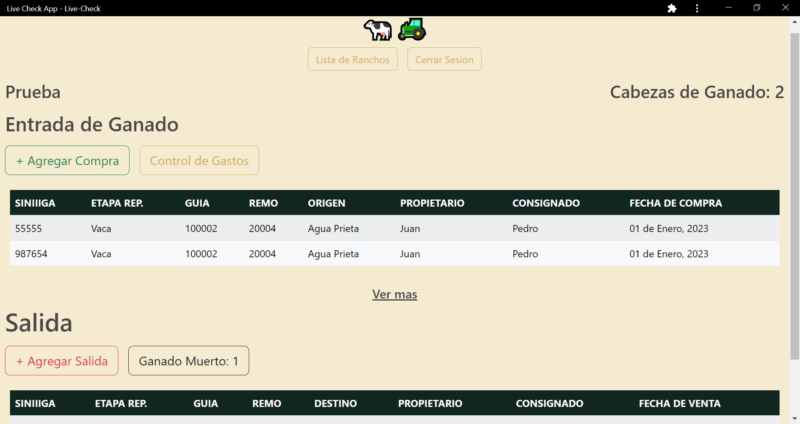

# Live-Check
## Description
  
- Reason behind the project: A client requested a web application capable of storing, retrieving, and updating data for livestock and other transactions.
- Purpose or Problem Solved: It creates a persistent database using mongoDB and allows access to livestock inventory, and expense management for the client's business
- Important information: The application has been built with the Frontend in Spanish per the client's preferred language.
  
## Table of Contents (Optional)
  
- [Installation](#installation)
- [Credits](#credits)
- [Techstack](#techstack)
- [Questions](#questions)
  
## Installation

This is a PWA. Follow the link and click install!
http://live-check.herokuapp.com

Screenshot attatched
  

  
## Credits
  
Collaborators: No other collaborators. 
  
## Techstack
MERN  
React.js, Recharts.js, Bootstrap, Express, JWT, bcrypt, NoSQL, mongoDB, PWA

## Questions
  
All questions and communications can be directed to:
Github: github.com/frivera14 
